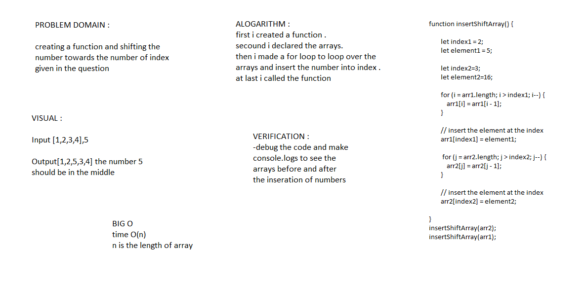
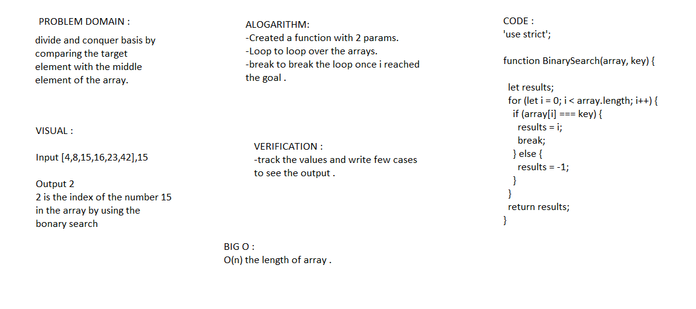

# data-structures-and-algorithms401

# ReverseArray

## Challenge :
-The reverse method transposes the elements of the calling array object in place, mutating the array, and returning a reference to the array.

## Approach & Efficiency
-For Loop
-O(n) length of the loop in the array 

## Solution

----------------------------------------------

# Shift array

# Challenge Summary
 return an array with the new value added at the middle index.

## Challenge Description
Write a function called insertShiftArray which takes in an array and the value to be added. 
## Approach & Efficiency
The approach I took for this challenge was first to get the index where I should be inserting the new value. I need to find what the middle point is of the given array, even if it has an even number of elements or odd.

This function has complexity of O(n) since insert it depends on the size of the array.

## Solution

----------------------------------------------
# Binary Search Array

# Challenge Summary
Binary Search (sometimes known as Logarithmic Search) is a widely popular algorithm to search a sorted array for the position of a given element.

## Challenge Description
It works on a divide and conquer basis by comparing the target element with the middle element of the array. 

## Approach & Efficiency
In Big-O Notation terms, an O(n) complexity.

## Solution

